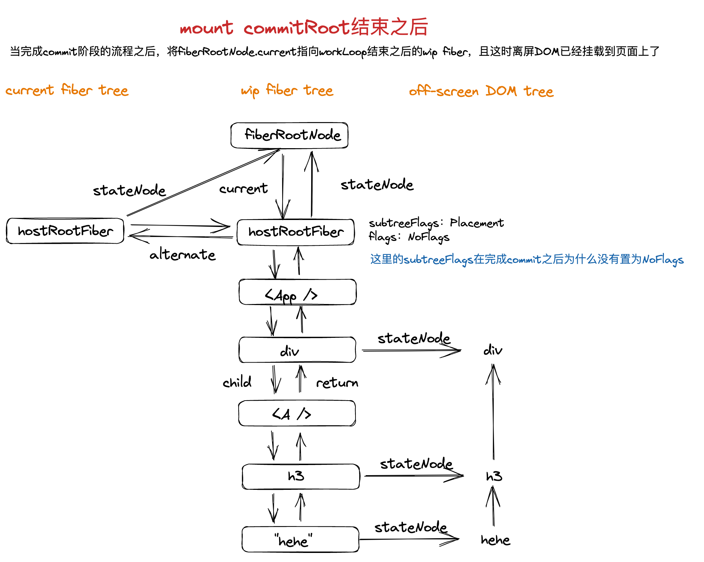

### useState 源码解析

#### mount 阶段 useState 原理

react 包里定义了一个内部对象，该对象上有一个 currentDispatcher 属性，该属性也是一个对象，其上面有一个 current 属性，用于存储 react 当前阶段时的 react hooks 集合，比如 mount 或者 update 阶段的 hooks 集合。

```typescript
// 当前使用的hooks集合
const currentDispatcher: { current: Dispatcher | null } = {
	current: null
};

// 内部数据共享层
export const __SECRET_INTERNALS_DO_NOT_USE_OR_YOU_WILL_BE_FIRED = {
	currentDispatcher
};
```

除此之外，还定义了一个 resolveDispatcher 函数，用于获取 currentDispatcher.current。

而我们引入的 hooks（这里目前仅用 useState 举例），其定义如下：

```typescript
export const useState: Dispatcher['useState'] = (initialState) => {
	const dispatcher = resolveDispatcher();
	return dispatcher.useState(initialState);
};
```

也就是说当我们在函数组件中调用 useState(initialValue)时，实际上是调用 currentDispatcher.current.useState(initialState)。

有上面可知，当 currentDispatcher.current 的初始值是 null。那么这个值是什么时候被赋值的呢？答案是：函数组件在执行之前赋值的。

那函数组件是什么时候执行的呢？

我们知道，react 在 mount 阶段和触发更新之后，会从根 fiber 节点开始以深度遍历优先的方式对 fiber 节点进行 beginWork 和 completeWork 操作。

beginWork 会根据 wip fiber 的子 current fiber（如果是 mount 阶段，则无子 current fiber）和子 element 生成子 wip fiber。而如何获取子 element 呢？对于函数组件对应的 wip fiber 来说，获取其子 element 便是通过执行函数组件获取的。执行过程在 react 源码中的方法名称为 renderWithHooks。

在 renderWithHooks 函数会接收 wip fiber，根据 wip fiber 的 alternate 属性（也就是当前 wip fiber 对应的 current fiber）是否存在来判断执行 renderWithHooks 时是 mount 时执行，还是 update 时执行。

假如是 mount 阶段，那么则会将 currentDispatcher.current 赋值为 HooksDispatcherOnMount；
假如是 update 阶段，那么则会将 currentDispatcher.current 赋值为 HooksDispatcherOnUpdate；

HooksDispatcherOnMount 里保存着 mount 阶段时的 react hooks 集合：

```typescript
const HooksDispatcherOnMount: Dispatcher = {
	useState: mountState
	// useEffect: mountEffect
	// ...
};
```

HooksDispatcherOnUpdate 里保存着 update 阶段时的 react hooks 集合：

```typescript
const HooksDispatcherOnMount: Dispatcher = {
	useState: updateState
	// useEffect: updateEffect
	// ...
};
```

赋值完成之后再执行调用函数组件，而这个时候函数组件里 hooks 的调用，实际上就是当前调度阶段下的 hooks 调用。
例如上述 useState：
在 mount 阶段时，调用的是 HooksDispatcherOnMount.useState，也就是 mountState；
在 update 阶段时，调用的是 HooksDispatcherOnUpdate.useState，也就是 updateState。

> 约定将 useState、useEffect 等这些函数统称为 hook 函数，而这些 hook 函数在调用过程中生成的用于存储数据的数据结构称为 hook。

接下来看看 mountState 的逻辑。

// ...临时

**1. 调用 mountWorkInProgressHook 方法，生成空的 hook 对象。**

hook 是一种数据结构，其内部包含了 memorizedState、updateQueue、next 等属性。对于不同 hook 函数来说，这些属性保存的数据是不一样的，对于 useState 来说：

- memorizedState 保存着 useState 的状态值；
- updateQueue 是更新队列，用于保存 setState 传入的 action，由于 setState 会触发更新，所以在下一次函数组件执行的时候，就能根据这个保存的 action 来更新 state；
- next 指向这个函数组件中，下一个 hook 函数对应的 hook。

```typescript
interface Hook {
	memorizedState: any;
	updateQueue: unknown;
	next: Hook | null;
}
```

至此我们 hook 里的属性还都是 null。

**2. 根据 useState 传入的初始值来初始化 state，并将初始化 state 保存到 hook.memorizedState 中**

如果传入 useState 的 initialState 是一个值，则初始 state 就是这个值，如果传入 useState 的 initialState 是一个函数，则执行函数函数并获取它的返回值。

**3. 初始化 updateQueue**

调用内部 createUpdateQueue 方法生成一个初始化的 updateQueue 并保存到 hook.updateQueue 上。其数据类型如下:

```typescript
// 代表更新的数据结构
export interface Update<State> {
	action: Action<State>;
}

// 更新的队列
export interface UpdateQueue<State> {
	shared: {
		// TODO 这里不应该是一个数组?
		pending: Update<State> | null;
	};
	dispatch: Dispatch<State> | null;
}
```

**4. 生成 setState 方法**
setState 本质上是一个 dispatch 函数，该函数会绑定当前函数组件对应的 fiber，以及该 useState 对应的 hook 对象的 updateQueue，并接受一个 action 参数。其数据类型如下：

```typescript
export type Dispatch<State> = (action: Action<State>) => void;
```

当执行 setState(action)之后，会将这个 action 保存到 hook 对象上的 updateQueue 里，并**开始调度更新**。

**5. 返回初始化 state 以及 setState 组成的数组**

那么上述 useState 的 hook 对象保存在哪里呢？它又是如何能记住一个函数组件的状态呢？
在执行函数组件的过程中，我们会依次在函数组件里调用不同的 react hook，而这些 hooks 最终是以一个链表的形式存储在当前函数组件对应的 fiber.memorizedState 中。也就是说对于一个函数组件，其内部调用的 hook 函数对应的 hook 对象实际上都保存在这个函数组件对应的 fiber 上。如何做到这一步？这便是上述 mountWorkInProgressHook 做的事情。其逻辑如下：

```typescript
/**
 * 在mount阶段，创建hook，并将函数组件中的所有hooks由上到下形成一个链表结构，存储在memorizedState中
 * 在每次renderWithHook函数调用之后，该函数里的workInProgressHook会被重置
 * @returns 当前执行到的hook
 */
function mountWorkInProgressHook(): Hook {
	const hook: Hook = {
		memorizedState: null,
		updateQueue: null,
		next: null
	};
	// mount时的第一个hook
	if (workInProgressHook === null) {
		// 代表着没有在函数组件内调用hooks
		if (currentlyRenderingFiber === null) {
			throw new Error('请在函数组件内调用hook');
		} else {
			workInProgressHook = hook;
			currentlyRenderingFiber.memorizedState = workInProgressHook;
		}
	} else {
		// mount时后续的hook
		workInProgressHook.next = hook;
		workInProgressHook = hook;
	}
	return workInProgressHook;
}
```

至此，我们知道了 mount 阶段时 useState 的原理。当 mount 阶段结束之后，调用 useState 的函数组件对应的 current fiber 上的 memorizedState 上会保存着所有的在该函数组件内部调用的 hook 函数对应的 hook 对象，且以链表的形式存储。

```shell
memorizedState -> hook   ->   hook   ->   hook -> ...
				hook.next   hook.next
```

#### update 阶段 useState 原理

当执行了 setState 之后，发生了什么？
我们先观察 mountState 中 dispatch 函数的定义，也就是 setState 函数：

```typescript
const dispatch = dispatchSetState.bind(null, currentlyRenderingFiber, queue);

function dispatchSetState<State>(
	fiber: FiberNode,
	updateQueue: UpdateQueue<State>,
	action: Action<State>
) {
	const update = createUpdate(action);
	enqueueUpdate(updateQueue, update);
	scheduleUpdateOnFiber(fiber);
}
```

可以发现，setState 本质上是一个 dispatch 函数，该函数会关联当前函数组件对应的 fiber，以及该 useState hook 对象的 updateQueue，当在函数组件中执行了 setState 后（这里我们并没有处理在挂载的时候就执行 setState 的逻辑，仅考虑通过事件触发或者其他方式触发比如 setTimeout），我们会用新的 action 创建一个 update 并放到当前 useState hook 的 updateQueue 上，并且从当前 fiber 开始调度更新。

接下来以 test-useState 为 demo，我们一步一步调试当调用 setState 之后的调度更新流程。

首先先看看 mount 阶段完成 commitWork 之后，内存中 fiber 的结构：


接下来我继续从 scheduleUpdateOnFiber 开始调试：

> 这里忽略 A wip fiber 之前的过程，仅用图表示


当 wip fiber 为 A 组件时，在其 beginWork 里会执行 renderWithHooks。观察 renderWithHooks 逻辑可以发现 renderWithHooks 做了如下操作：

```typescript
wip.memorizedState = null;

const current = wip.alternate;

if (current !== null) {
	// update
	currentDispatcher.current = HooksDispatcherOnUpdate;
} else {
	// mount
	// 这里就指向了mount时hooks的实现
	currentDispatcher.current = HooksDispatcherOnMount;
}
```

1. 将 wip fiber 上的 memorizedState 清空（在创建这个 wip fiber 的时候，它从 current fiber 上继承了这个 memorizedState）。
2. 将 currentDispatcher.current 指向 HooksDispatcherOnUpdate，也就是说它指向了 update 时的 hooks 集合：

```typescript
const HooksDispatcherOnUpdate: Dispatcher = {
	useState: updateState
	// useEffect: updateEffect,
	// ...
};
```

上述两步完成之后，内存中的数据结构如下：

也就是说在接下来执行函数时，函数组件内部调用 useState 时，与 mount 时不一样，mount 时是调用 mountState，而此时调用的是 updateState。

我们来看看 updateState 的逻辑：

```typescript
function updateState<State>(): [State, Dispatch<State>] {
	// 根据current fiber上对应的hook对象创建new hook对象，这个new Hook对象会继承hook对象的memorizedState以及updateQueue
	const hook = updateWorkInProgressHook();

	// 计算新的memorizedState
	const queue = hook.updateQueue as UpdateQueue<State>;
	const pending = queue.shared.pending;

	if (pending !== null) {
		const { memorizedState } = processUpdateQueue(hook.memorizedState, pending);
		hook.memorizedState = memorizedState;
	}

	// 返回新的state以及dispatch函数
	return [hook.memorizedState, queue.dispatch as Dispatch<State>];
}
```

首先执行 updateWorkInProgressHook()。
该方法会利用 current fiber 上对应的 hook 对象生成一个 new Hook 对象，而这个 new Hook 对象会继承 hook 对象的 memorizedState 以及 updateQueue。

> 需要注意，这个方法不仅仅会在 updateState 里执行，对于任何 hook 函数，其 update 版本里都会执行 updateWorkInProgressHook。由于 wip fiber 的 hook 对象链表在此之前被清空了，所以理论上来说，在函数组件执行完毕之后，wip fiber 上任然是一个 hook 对象的链表，且这些 hook 都是 new hook（经过原来 hook 的 memorizedState 以及 updateQueue 处理过的）。updateWorkInProgressHook 根据该 hook 函数在 current fiber 上对应的 hook 来创建该 hook 函数的 new hook，并且按照原来 current fiber 上的 hook 链表的结构在 wip fiber 上创建对应的 new hook 链表。

接下来通过 updateQueue 上的 action 来进行新的 state
最后依旧是返回新的 state 以及 dispatch 函数。

所以当 renderWithHooks 里执行函数组件时，执行 useState 时会使用新的 state 来 render。

最后，当执行完 renderWithHooks 之后，内存中的数据结构为：


可以发现 A 函数组件执行之后返回的 element 为：

```tsx
<h3 onClick={() => setNum(num + 1)}>101</h3>
```

和当前页面上的真实 DOM 有些不一样，且 h3 current fiber 的 child 为"hehe" current fiber。
后续会进行单节点 diff。

我们继续往下看，当完成 A wip fiber 的 beginWork 之后，内存中的 fiber 结构如下：
。

接下来执行 h3 wip fiber 的 beginWork。由于 h3 wip fiber 为 HostComponent 类型的 fiber，所以 nextChildren 直接从 pendingProp.children 里取：

```typescript
// 由于HostComponent fiber对应的是原生标签 所以无法触发更新，所以只需生成子fiber即可
function updateHostComponent(wip: FiberNode) {
	const nextProps = wip.pendingProps;
	const nextChildren = nextProps.children;
	reconcileChildren(wip, nextChildren);
	return wip.child;
}
```

在执行 reconcileChildren 中，由于 nextChildren 为 101，也就是 number，所以会走 reconcileSingleTextNode 的逻辑，当完成所有 wip fiber 的 benginWork 之后，内存中的数据结构如下：
。

<!-- 接下来是completeWork过程，在101 wip fiber的completeWork过程中，会被打上Update的标记，后续再继续调试... -->
