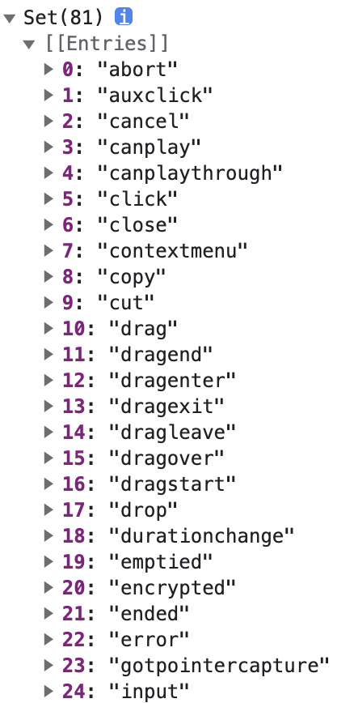
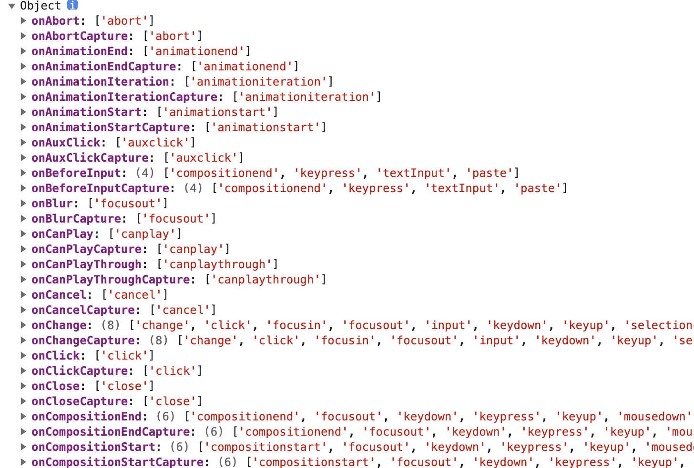
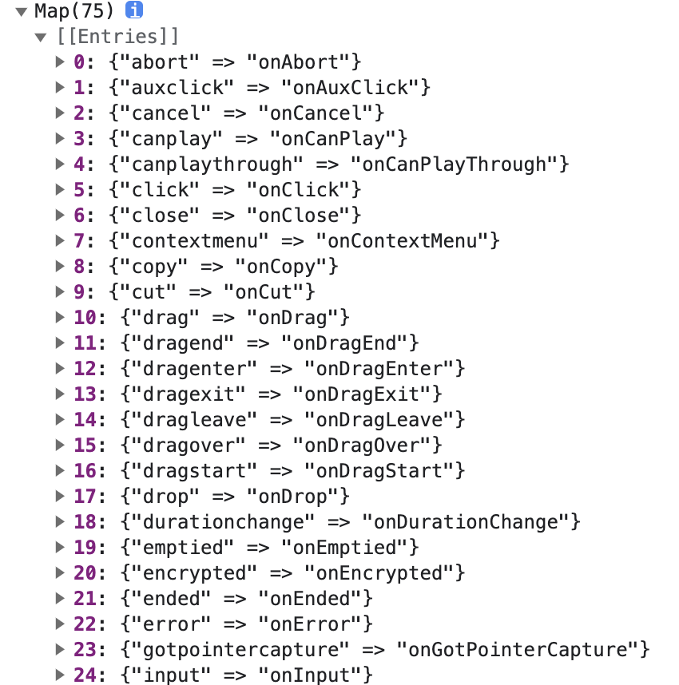
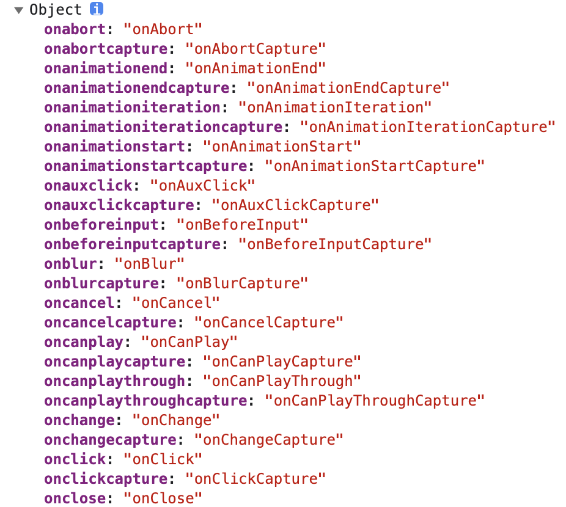

- [ ] addEventListener 监听多个事件的本质

- [ ] addEventListener 监听事件的可选参数、passive、once 等

- [ ] goole 浏览器查看事件对象

- [ ] onclick 和 onclickCapture 的区别

- [ ] 离开文档流的元素会怎么样？

离开文档流任然遵循事件捕获和冒泡流程

```javascript
addEventListener(type, listener, useCapture);
```

无论是部署

在第四代浏览器的时候，IE4 和网景公司分别实现了事件冒泡流（IE 事件流）和事件捕获流

事件冒泡流

具体的元素先触发事件，然后事件沿着 DOM 树一路往上，在经过的节点上依次触发，直到 document 对象，现代浏览器会直到 window 对象上。

事件捕获流

事件首先由 document 对象捕获，然后沿着 DOM 树依次向下传播，直到目标元素。虽然 DOM2 Events 规定从 document 对象开始捕获，但是现代浏览器都从 window 对象开始捕获

DOM2 Events

由于最初两家公司实现不一致，所以为了规范各大浏览器的实现，出了一个 DOM2 Events

DOM2Events 规范规定事件流分为三个阶段：

- 事件捕获

- 到达目标

- 事件冒泡

到达目标通常被认为是事件冒泡的一部分。

虽然 DOM2 Events 规范规定事件捕获阶段不命中事件目标，但是现代浏览器都会在捕获阶段在事件目标上触发事件。

事件处理程序有三种方式：

**直接在 html 元素上指定某个事件相关的属性，比如 onclick 等**

```javascript
<input type="button" value="Click Me" onclick="console.log('Clicked')" />
```

由于现在几乎不会使用上面这种方式，暂不讨论。

**DOM0 事件处理程序**

把一个函数赋值给（DOM 元素的）一个事件处理程序属性。比如如果要绑定 click 事件，则将函数赋值给 onclick 属性。

```javascript
let btn = document.getElementById('myBtn');
btn.onclick = function () {
	console.log('Clicked');
};
```

需要注意的几个点：

1. 事件处理程序会在元素的作用域中运行，即 this 等于元素本身（除非使用箭头函数，箭头函数的 this 指向其上层作用域）

2. 以这种方式添加事件处理程序是注册在事件流的冒泡阶段的（无法设置在捕获阶段？）

3. 无法设置多个事件处理程序

4. 可以通过 e.stopPropagation()来阻止事件继续冒泡，但是还是会触发本身的事件函数

5. 通过将事件处理程序属性的值设置为 null，可以移除通过 DOM0 方式添加的事件处理程序

**DOM2 事件处理程序**

使用 addEventListener 来注册事件。

常用的 API 有如下两个

```javascript
addEventListener(type, listener);
addEventListener(type, listener, useCapture);
```

type 表示事件类型，listener 表示事件处理函数，useCaptrue 默认值为 false，表示在冒泡阶段触发当前 listener，如果设置为 true，则表示在捕获阶段触发。

> 如果如何，事件流都会完成捕获和冒泡，useCapture 只是决定该事件在哪个阶段触发

注意点：

1. 事件处理程序会在元素的作用域中运行，即 this 等于元素本身（除非使用箭头函数，箭头函数的 this 指向其上层作用域）

2. 通过第三个参数，可以控制是在冒泡阶段还是捕获阶段

3. 可以为一个元素添加多个事件处理程序，它们会按照被添加的顺序触发

4. 可以通过 e.stopPropagation()来阻止事件继续冒泡，但是还是会触发本身的事件函数

5. 通过 addEventListener()添加的事件处理程序只能使用 removeEventListener()并传入与添加时同样的参数来移除。这意味着使用 addEventListener()添加的匿名函数无法移除

- [ ] 第三个参数是一个对象的情况，需要再次讨论

**IE 事件处理程序**

attachEvnet 和 detachEvent。不讨论了。

事件对象

无论是 onclick 还是 addEventListener，事件处理程序上都会传入一个事件对象。事件对象有几个重要的属性和方法：

e.currentTarget 只读 总是指向事件绑定的元素

e.target 只读 触发事件的元素

```html
<body>
	<div>点我</div>
</body>

document.body.addEventlistener('click', (e) => { e.currentTarget ===
document.body // true e.target === document.body; })
```

如果是通过直接点击 body，那么第二个判断条件为 true；如果是通过点击 div，事件流冒泡到 body 上导致触发 body 的 click 事件的回调函数，那么
e.target === div，而非 body

e.type 只读 描述了被触发的事件类型

e.eventPhase。 只读。确定事件流当前所处的阶段，如果时间处理程序在捕获阶段被调用，则为 1， 如果事件处理程序在目标上被调用，则为 2；如果事件处理程序在冒泡阶段被调用，则为 3。

注意：虽然“目标阶段”被认为是冒泡阶段的一部分，但是 eventPhase 任然等于 2，初次之外，如果在 addEvenListener 里加上了 useCapture，那么由于也会在目标阶段触发这个事件处理函数，所以 eventPhase 任然为 2

e.stopPropagation() 阻止事件继续冒泡

e.preventDefault() 阻止元素的默认点击事件，比如 a 标签的跳转

API 细节

addEventListener 第三个参数除了可以传递一个 useCapture 的布尔值，还可以传递一个 options 对象。options 对象里可以传递四个属性：

capture：作用与 useCapture 一致，默认值为 false

once：布尔值，表示事件处理函数在添加之后最后会被调用一次（无论是目标阶段，还是冒泡阶段，还是捕获阶段），如果为 true，则在被调用之后被移除

passive：布尔值，设置为 true 时，表示 listener 永远不会调用 preventDefault()。如果 listener 任然调用了这个函数，客户端将会忽略并抛出一个控制台警告

signal：略


removeEventListener。

如果同一个事件监听器分别为“事件捕获（`capture`  为  `true`）”和“事件冒泡（`capture`  为  `false`）”注册了一次，这两个版本的监听器需要分别移除。移除捕获监听器不会影响非捕获版本的相同监听器，反之亦然。

```javascript
element.addEventListener('mousedown', handleMouseDown, true);

element.removeEventListener('mousedown', handleMouseDown, false); // 失败
element.removeEventListener('mousedown', handleMouseDown, true); // 成功

// 这说明只有 capture 配置影响 removeEventListener()。
element.addEventListener('mousedown', handleMouseDown, { passive: true });

element.removeEventListener('mousedown', handleMouseDown, { passive: true }); // 成功
element.removeEventListener('mousedown', handleMouseDown, { capture: false }); // 成功
element.removeEventListener('mousedown', handleMouseDown, { capture: true }); // 失败
element.removeEventListener('mousedown', handleMouseDown, { passive: false }); // 成功
element.removeEventListener('mousedown', handleMouseDown, false); // 成功
element.removeEventListener('mousedown', handleMouseDown, true); // 失败
```

dispatchEvent

不需要用户触发，相当于通过编程的方式派发一个事件。

创建和触发 events。

```javascript
var event = new Event('build');

// Listen for the event.
elem.addEventListener('build', function (e) { ... }, false);

// Dispatch the event.
elem.dispatchEvent(event);
```

Event 构造函数可以创建一个自定义事件，也可以传入浏览器原生事件。

```javascript
event = new Event(typeArg, eventInit);
EventInit是一个对象，可以接受：
"bubbles"，可选，Boolean类型，默认值为 false，表示该事件是否冒泡。
"cancelable"，可选，Boolean类型，默认值为 false，表示该事件能否被取消。
"composed"，可选，Boolean类型，默认值为 false，指示事件是否会在影子 DOM 根节点之外触发侦听器。
```

```javascript
// 创建一个支持冒泡且不能被取消的 look 事件

var ev = new Event('look', { bubbles: true, cancelable: false });
document.dispatchEvent(ev);

// 事件可以在任何元素触发，不仅仅是 document。
// ev.target === myDiv
myDiv.dispatchEvent(ev);
```

上面的 look 如果替换为 click 等内置事件名称，则当 dispatchEvent 之后，相当于手动点击了 myDiv。

dispatchEvent。

实际上：调用  `dispatchEvent()`  是用户触发一个事件的最后一步。被触发的事件应事先通过  [`Event()`](https://developer.mozilla.org/zh-CN/docs/Web/API/Event/Event 'Event()')  构造函数创建并初始化完毕。所以标准事件处理规则（包括事件捕获和可选的冒泡过程）同样适用于通过手动使用  `dispatchEvent()`  方法派发的事件。

和经由浏览器触发，并通过[事件循环](https://developer.mozilla.org/zh-CN/docs/Web/JavaScript/Event_loop)异步调用事件处理程序的“原生”事件不同，`dispatchEvent()`  会*同步*调用事件处理函数。在  `dispatchEvent()`  返回之前，所有监听该事件的事件处理程序将在代码继续前执行并返回。

React 合成事件

本质上是[事件委托]([事件介绍 - 学习 Web 开发 | MDN](https://developer.mozilla.org/zh-CN/docs/Learn/JavaScript/Building_blocks/Events#%E4%BA%8B%E4%BB%B6%E5%A7%94%E6%89%98))

React 事件系统主要分为事件注册、事件绑定和事件触发三部分。

#### 事件注册

React 事件注册，主要就是提取要监听的原生事件名字，并且把原生事件名字和 React 中的事件名字的映射起来。事件注册由 React 调用不同事件插件的 registerEvents 函数自行完成

`DOMPluginEventSystem.js`

```typescript
//! 事件注册，这一部分由react自己执行
// TODO: remove top-level side effect.
SimpleEventPlugin.registerEvents();
EnterLeaveEventPlugin.registerEvents();
ChangeEventPlugin.registerEvents();
SelectEventPlugin.registerEvents();
BeforeInputEventPlugin.registerEvents();
```

在进入到不同的 registerEvents 函数的逻辑之前，我们先看看另外两个关键函数，因为在这些 registerEvents 里，最后都会调用这两个关键函数。

`EventRegistry.js`

```typescript
// 其他代码，略...

// 记录所有原生事件名
export const allNativeEvents: Set<DOMEventName> = new Set();

// 记录"react注册的事件名"->"依赖的原生事件名"的映射
export const registrationNameDependencies = {};

export const possibleRegistrationNames = __DEV__ ? {} : (null: any);

/**
 * 有些事件不需要注册捕获阶段触发的事件名，但是对于大多数事件来说，有冒泡和捕获两个版本，所以这里对registerDirectEvent进行一个二次封装，分别注册冒泡和捕获版本
 * @param {*} registrationName react注册的事件的名称（冒泡版本的名称），比如onClick
 * @param {*} dependencies react事件对应的原生事件依赖，比如onClick对应['click']
 */
export function registerTwoPhaseEvent(
  registrationName: string,
  dependencies: Array<DOMEventName>,
): void {
  debugger;
  registerDirectEvent(registrationName, dependencies);
  registerDirectEvent(registrationName + 'Capture', dependencies);
}

/**
 * 接收react注册的事件名称（比如onClick、onMouseLeave、onClickCapture）和该事件依赖的原生事件名数组（比如如果react事件名为onMouseEnter，则dependencies为['mouseout', 'mouseover']）
 * 将react事件名作为key，其对应的依赖原生事件名数组作为value放到全局变量registrationNameDependencies里
 * 遍历依赖的原生事件名依次放到全局变量allNativeEvents里，该变量指向一个set（因为不同的react事件可能依赖不同的原生事件名，可能存在重复，set可以保证唯一性）
 * @param {*} registrationName
 * @param {*} dependencies
 */
export function registerDirectEvent(
  registrationName: string,
  dependencies: Array<DOMEventName>,
) {
  // __DEV__下的其他代码，略...

  registrationNameDependencies[registrationName] = dependencies;

  if (__DEV__) {
    const lowerCasedName = registrationName.toLowerCase();
    possibleRegistrationNames[lowerCasedName] = registrationName;

    if (registrationName === 'onDoubleClick') {
      possibleRegistrationNames.ondblclick = registrationName;
    }
  }

  for (let i = 0; i < dependencies.length; i++) {
    allNativeEvents.add(dependencies[i]);
  }
}
```

**`registerDirectEvent`函数接受将要注册的 React 事件名称和该 React 事件依赖的原生事件名数组，然后将其映射关系放到全局`registrationNameDependencies`对象里，并更新`allNativeEvents`和`possibleRegistrationNames`全局对象。**

**`registerTwoPhaseEvent`函数是对`registerDirectEvent`函数的二次封装，分别注册 React 事件的冒泡版本和捕获版本。**

至于为什么要维护`allNativeEvents`和`registrationNameDependencies`和`allNativeEvents`和`possibleRegistrationNames`这四个数据结构，在后续介绍里会仔细说明。

看完上面两个函数之后，我们再回过头来看看上面几个`registerEvents`函数。

_我们暂且将`SimpleEventPlugin.registerEvents()`放到最后来看，因为这个函数稍微复杂那么一点点。_

**EnterLeaveEventPlugin.registerEvents()**

该函数直接注册了 onMouseEnter、onMouseLeave、onPointerEnter、onPointerLeave 的**冒泡版本**react 事件。

```javascript
function registerEvents() {
	registerDirectEvent('onMouseEnter', ['mouseout', 'mouseover']);
	registerDirectEvent('onMouseLeave', ['mouseout', 'mouseover']);
	registerDirectEvent('onPointerEnter', ['pointerout', 'pointerover']);
	registerDirectEvent('onPointerLeave', ['pointerout', 'pointerover']);
}
```

**ChangeEventPlugin.registerEvents()**

该函数注册了 onChange 的**冒泡和捕获**版本 React 事件

```javascript
function registerEvents() {
	registerTwoPhaseEvent('onChange', [
		'change',
		'click',
		'focusin',
		'focusout',
		'input',
		'keydown',
		'keyup',
		'selectionchange'
	]);
}
```

**SelectEventPlugin.registerEvents()**

该函数注册了 onSelect 的**冒泡和捕获**版本 React 事件

```javascript
function registerEvents() {
	registerTwoPhaseEvent('onSelect', [
		'focusout',
		'contextmenu',
		'dragend',
		'focusin',
		'keydown',
		'keyup',
		'mousedown',
		'mouseup',
		'selectionchange'
	]);
}
```

**BeforeInputEventPlugin.registerEvents()**

该函数注册了 onBeforeInput、onCompositionEnd、onCompositionStart、onCompositionUpdate 的**冒泡和捕获**版本 React 事件

```javascript
function registerEvents() {
	registerTwoPhaseEvent('onBeforeInput', [
		'compositionend',
		'keypress',
		'textInput',
		'paste'
	]);
	registerTwoPhaseEvent('onCompositionEnd', [
		'compositionend',
		'focusout',
		'keydown',
		'keypress',
		'keyup',
		'mousedown'
	]);
	registerTwoPhaseEvent('onCompositionStart', [
		'compositionstart',
		'focusout',
		'keydown',
		'keypress',
		'keyup',
		'mousedown'
	]);
	registerTwoPhaseEvent('onCompositionUpdate', [
		'compositionupdate',
		'focusout',
		'keydown',
		'keypress',
		'keyup',
		'mousedown'
	]);
}
```

`SimpleEventPlugin.registerEvents()`注册了 React 大部分事件，它实际上是调用`registerSimpleEvents`，该方法会将 simpleEventPluginEvents 里的事件处理成 React 事件名称的冒泡版本和原生事件名称，并注册冒泡和捕获两个版本的 React 事件。除此之外，还会将“原生事件名”->“React 事件名的冒泡版本”映射存储到 topLevelEventsToReactNames 这个全局 Map 里

```javascript
export const topLevelEventsToReactNames: Map<DOMEventName, string | null> =
	new Map();

// 原生事件名称的小驼峰写法，这么写是为了方便地获得React注册的事件名称和原生事件名称
const simpleEventPluginEvents = [
	'abort',
	'auxClick',
	'cancel',
	'canPlay',
	'canPlayThrough',
	'click',
	'close',
	'contextMenu',
	'copy',
	'cut',
	'drag',
	'dragEnd',
	'dragEnter',
	'dragExit',
	'dragLeave',
	'dragOver',
	'dragStart',
	'drop',
	'durationChange',
	'emptied',
	'encrypted',
	'ended',
	'error',
	'gotPointerCapture',
	'input',
	'invalid',
	'keyDown',
	'keyPress',
	'keyUp',
	'load',
	'loadedData',
	'loadedMetadata',
	'loadStart',
	'lostPointerCapture',
	'mouseDown',
	'mouseMove',
	'mouseOut',
	'mouseOver',
	'mouseUp',
	'paste',
	'pause',
	'play',
	'playing',
	'pointerCancel',
	'pointerDown',
	'pointerMove',
	'pointerOut',
	'pointerOver',
	'pointerUp',
	'progress',
	'rateChange',
	'reset',
	'resize',
	'seeked',
	'seeking',
	'stalled',
	'submit',
	'suspend',
	'timeUpdate',
	'touchCancel',
	'touchEnd',
	'touchStart',
	'volumeChange',
	'scroll',
	'toggle',
	'touchMove',
	'waiting',
	'wheel'
];

/**
 * 注册简单React事件
 * 并将“原生事件名”->“React事件名的冒泡版本”映射存储到topLevelEventsToReactNames这个全局Map里
 * 简单事件是指React事件仅依赖一个原生事件名并且都存在冒泡和捕获版本？
 *
 * @param {*} domEventName 简单React事件唯一依赖的原生事件名
 * @param {*} reactName 简答React事件的冒泡版本名字
 */
function registerSimpleEvent(domEventName, reactName) {
	topLevelEventsToReactNames.set(domEventName, reactName);
	registerTwoPhaseEvent(reactName, [domEventName]);
}

export function registerSimpleEvents() {
	for (let i = 0; i < simpleEventPluginEvents.length; i++) {
		const eventName = ((simpleEventPluginEvents[i]: any): string);
		// 原生事件名称：click、mouseover、keyup等
		const domEventName = ((eventName.toLowerCase(): any): DOMEventName);
		// 原生事件名的大驼峰形式：Click、MouseOver、
		const capitalizedEvent = eventName[0].toUpperCase() + eventName.slice(1);
		registerSimpleEvent(domEventName, 'on' + capitalizedEvent);
	}
	// Special cases where event names don't match.
	registerSimpleEvent(ANIMATION_END, 'onAnimationEnd');
	registerSimpleEvent(ANIMATION_ITERATION, 'onAnimationIteration');
	registerSimpleEvent(ANIMATION_START, 'onAnimationStart');
	registerSimpleEvent('dblclick', 'onDoubleClick');
	registerSimpleEvent('focusin', 'onFocus');
	registerSimpleEvent('focusout', 'onBlur');
	registerSimpleEvent(TRANSITION_END, 'onTransitionEnd');
}
```

#### 小结

React 事件注册是通过调用不同事件插件的 registerEvents 函数自行完成的，在这个过程中，会为四个全局数据进行初始化以供后续的流程使用，分别为：`allNativeEvents`、`registrationNameDependencies`、`topLevelEventsToReactNames`和`possibleRegistrationNames`。

`allNativeEvents`是一个 Set 的数据结构，保存着在注册过程中使用到的所有"浏览器原生事件名称"。



`registrationNameDependencies`是一个简单对象数据结构，保存着"React 事件名称"到"该事件依赖的原生事件数组"的映射，比如：'onMouseEnter' -> ['mouseout', 'mouseover']。



`topLevelEventsToReactNames`是一个 Map 数据结构，保存着"原生事件名称"到"React 简单事件名称的冒泡版本"的映射，比如：'click' -> 'onClick'。



`possibleRegistrationNames`是一个简单对象数据结构，保存着"React 事件名称的小写形式"到"React 事件名称的正确写法"的映射，比如：'onclick' -> 'onClick'。



- [ ] 在事件注册阶段，为什么某些事件需要特殊处理，为什么不统一起来

- [ ] SimpleEventPlugin 里的事件有什么特点，简单事件是指 React 事件仅依赖一个原生事件名并且都存在冒泡和捕获版本？

- [ ] React 不同事件为什么要对应着不同的原生事件依赖

- [ ] 为什么有些 React 事件不需要冒泡版本

- [ ] 补充四个全局数据的作用

- [ ] extractEvents 的分析，这个有什么作用

### 事件绑定
