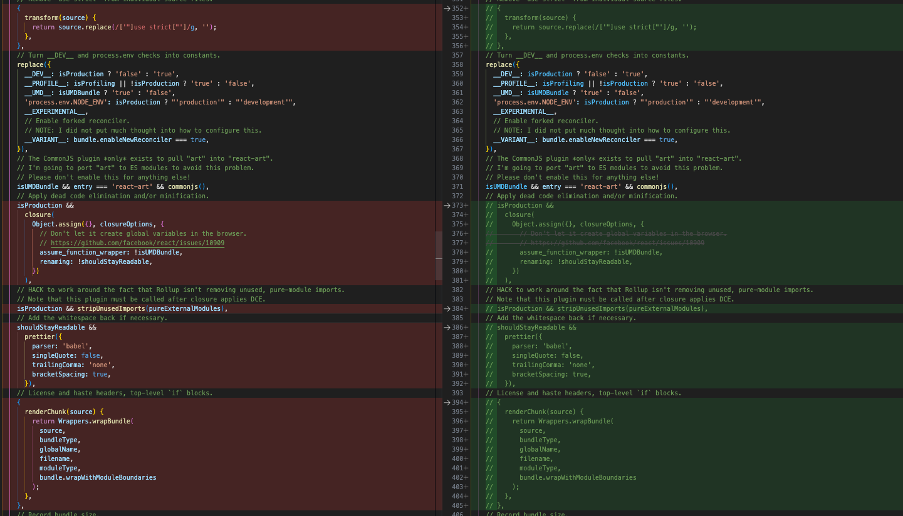
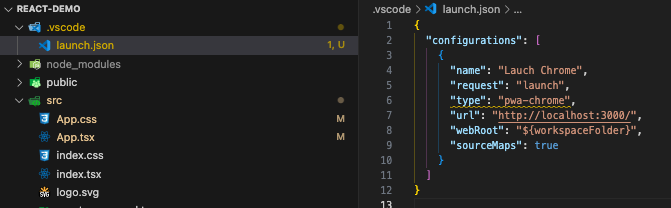
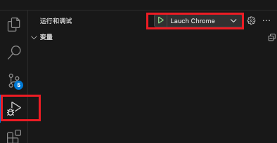

# 调试 React 源码的方法

我们以`react18.0.0`版本为例。

首先，我们从 react 仓库将 react 源码拉到本地。

```shell
git clone https://github.com/facebook/react.git
```

然后，切换分支到`v18.0.0`版本。

修改一些**scripts/rollup/build.js**里的配置：

首先将在 rollup 配置里开启 sourcemap：

```javascript
// 其他代码...
function getRollupOutputOptions(
	outputPath,
	format,
	globals,
	globalName,
	bundleType
) {
	const isProduction = isProductionBundleType(bundleType);

	return {
		file: outputPath,
		format,
		globals,
		freeze: !isProduction,
		interop: false,
		name: globalName,
		sourcemap: false, // TODO 这里改成true
		esModule: false
	};
}
// 其他代码...
```

如果此时直接打包 react 里的 packages，则会报如下错误：


这个是因为构建的过程中会进行多次转换，会生成多次 sourcemap，然后把 sourcemap 串联起来就是最终的 sourcemap。如果中间有一步转换没有生成 sourcemap，那就断掉了，也就没法把 sourcemap 串联起来了。这个问题的解决只要找出没有生成 sourcemap 的那几个插件注释掉就可以了。

```javascript
 {
   transform(source) {
     return source.replace(/['"]use strict["']/g, '');
   },
 },

 // 其他代码...

isProduction &&
   closure(
     Object.assign({}, closureOptions, {
       // Don't let it create global variables in the browser.
       // https://github.com/facebook/react/issues/10909
       assume_function_wrapper: !isUMDBundle,
       renaming: !shouldStayReadable,
     })
   ),
 // HACK to work around the fact that Rollup isn't removing unused, pure-module imports.
 // Note that this plugin must be called after closure applies DCE.
 isProduction && stripUnusedImports(pureExternalModules),
 // Add the whitespace back if necessary.
 shouldStayReadable &&
   prettier({
     parser: 'babel',
     singleQuote: false,
     trailingComma: 'none',
     bracketSpacing: true,
   }),
 // License and haste headers, top-level `if` blocks.
 {
   renderChunk(source) {
     return Wrappers.wrapBundle(
       source,
       bundleType,
       globalName,
       filename,
       moduleType,
       bundle.wrapWithModuleBoundaries
     );
   },
 },
```



接下来进入 react 包根目录安装依赖：

```shell
yarn
```

安装完成之后，对 react、react-dom、scheduler 包进行打包

```shell
yarn build react/index,react/jsx,react-dom/index,scheduler --type=NODE
```

打包完成之后，打包产物会在 build/node_modules/路径下，我们为 react、react-dom 创建 yarn link。

```shell
cd build/node_modules/react
# 申明react指向
yarn link
cd build/node_modules/react-dom
# 申明react-dom指向
yarn link
```

接下来我们使用 react 脚手架创建一个 react-demo

```shell
yarn create react-app react-demo --template typescript
```

然后在 react-demo 根目录下创建一个.vscode 文件，并添加一个 launch.json 文件，其内容为

```json
{
	"configurations": [
		{
			"name": "Lauch Chrome",
			"request": "launch",
			"type": "pwa-chrome",
			"url": "http://localhost:3000/",
			"webRoot": "${workspaceFolder}",
			"sourceMaps": true
		}
	]
}
```



将该 react-demo 项目的 react 和 react-dom 包链接到 react 打包的产物上：

```shell
yarn link react react-dom
```

跑起项目:

```shell
yarn start
```

跑起来之后，自动在浏览器打开的页面不不用管，我们在 vscode 里进入运行和调试界面，并点击 Launch Chrome 即可



更多请参考：
[全网最优雅的 React 源码调试方式](https://juejin.cn/post/7126501202866470949#heading-3)
