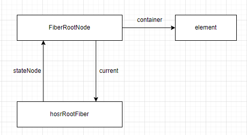

### 为什么写 React 组件的时候，需要先引入 React？

因为在 React 17 的 RC 版本之前，jsx 经过 babel 编译之后，会变成 React.createElement 的函数调用，如果在文件内不引入 React，则会报错找不到 React。

而在 React 17 RC 版本及之后，React 和 Babel 合作，发布了全新的 jsx 转换方式，在源码中新增了`jsx`和`jsxDEV`方法并分别在 `React/jsx-runtime.js`和`React/jsx-dev-runtime.js`导出。这样当 Babel 对 jsx 进行编译的时候，会自动引入这两个包的 jsx 方法，并将 jsx 编译为 jsx 函数的调用形式。所以就不需要我们手动引入 React 了。

进入[Babel 官网](https://babeljs.io/)，我们可以选择 React runtime 分别为`Classic`和`Automatic`，前者是旧版的 React.createElement 调用，后者是新版的 jsx 调用。

以下面这一段 jsx 来举例，Babel 在这两种 runtime 下编译后的结果（去掉``注释）

```jsx
<App id="app" onClick={add} ref={ref}>
	<h2 class="title" key="titleKey">
		Title
	</h2>
	<p>
		<div></div>
	</p>
	<></>
	Pure Text
</App>
```

**Classic**

```javascript
React.createElement(
	App,
	{
		id: 'app',
		onClick: add,
		ref: ref
	},
	React.createElement(
		'h2',
		{
			class: 'title',
			key: 'titleKey'
		},
		'Title'
	),
	React.createElement('p', null, React.createElement('div', null)),
	React.createElement(React.Fragment, null),
	'Pure Text'
);
```

**Automatic**

```javascript
import { jsx as _jsx } from 'react/jsx-runtime';
import { Fragment as _Fragment } from 'react/jsx-runtime';
import { jsxs as _jsxs } from 'react/jsx-runtime';
_jsxs(App, {
	id: 'app',
	onClick: add,
	ref: ref,
	children: [
		_jsx(
			'h2',
			{
				class: 'title',
				children: 'Title'
			},
			'titleKey'
		),
		_jsx('p', {
			children: _jsx('div', {})
		}),
		_jsx(_Fragment, {}),
		'Pure Text'
	]
});
```

- [ ] React.CreateElement 和 jsx 方法有什么区别？
- [ ] jsx、jsxs、jsxDEV 又分别有什么区别？

### 说说 jsx 或者 React.createElement 方法

jsx 和 createElement 方法会返回一种叫做 ReactElement 的数据结构，ReactElement 同时也是一个方法，jsx 和 createElement 方法会返回 ReactElement 方法的调用生成 ReactElement。
也就是说 jsx 和 createElement 主要是预处理一些数据，并将这些预处理数据交由 ReactElement 方法生成 ReactElement。

**ReactElement 方法**
ReactElement 方法接受 `type`、`key`、`ref`、`props` 参数，内部创建一个 `element` 对象，将这些参数放到 `element` 对象上，并加上一些额外的参数，然后返回 `element`

```typescript
const ReactElement = function (
	type: Type,
	key: Key,
	ref: Ref,
	props: Props
): ReactElementType {
	const element = {
		$$typeof: REACT_ELEMENT_TYPE,
		type,
		key,
		ref,
		props,
		__mark: 'KaSong'
	};
	return element;
};
```

**createElement**

```typescript
const createElement = (
	type: ElementType,
	config: any,
	...maybeChildren: any
) => {
	// 预处理，包括如下步骤：
	// 0. 定义key、ref和props变量
	// 1. 遍历config参数，从里面将key和ref单独拿出来，并将其他属性放到props上
	// 2. 处理children，将其赋值给props.children。如果children只有一个，那么props.children就是该child ReactElement对象，如果children有多个，则props.children是一个数组
	return ReactElement(type, key, ref, props);
};
```

**jsx**

```typescript
const jsx = (type: ElementType, config: any, maybeKey: any) => {
	// 预处理，包括如下步骤：
	// 0. 定义key、ref和props变量
	// 1. 将maybeKey复制给key
	// 2. 遍历config参数，从里面将key和ref单独拿出来，并将其他属性放到props上。如果存在key，则覆盖之前的mayKey，如果不存在，则key任然保持之前的maybeKey
	return ReactElement(type, key, ref, props);
};
```

可以发现 jsx 相比较与 createElement，不需要再处理 children 了，因为在 Babel 以 Automatic runtime 编译时，会将 children 作为 config 的一个参数传给 jsx 函数（注意：与 ReactElement 一样，如果 children 只有一个，那么这个属性为一个对象，如果有多个，则为一个数组）。除此之外，jsx 还多个 maybeKey 参数，特殊处理 key 值，在 Babel 以 Automatic runtime 编译时，key 值会作为 jsx 函数的一个参数单独传入。

- [ ] ReactElement 上的额外参数有哪些，分别有什么作用（比如：`$$typeof`等）？

### mount 阶段 reconciler 流程。

mount 阶段流程要从下面这段代码说起：

```typescript
ReactDOM.createRoot(element).render(<App />);
```

其中 createRoot 方法里会调用一个叫 createContainer 的方法，并返回一个对象，该对象上有一个 render 方法。

我们先来看看 createContainer：
createContainer 方法会执行如下流程：

1. 为宿主根元素创建其对应的 hostRootFiber（tag 为 HostRoot）
2. 创建 FiberRootNode，该对象负责管理该应用的全局事宜，比如 current fiber 和 wip fiber 之间的切换，在其构造函数中传入宿主根节点、hostRootFiber，这个时候 FiberRootNode.container = element, FiberRootNode.current = hostRootFiber, hostRootFiber.stateNode = FiberRootNode
3. 为 hostRootFiber 添加一个空的更新队列
4. 返回 FiberRootNode

相当于该方法会初始化一个数据结构，为后续的渲染做准备，其初始化的数据结构如下：


那么 render 方法会干些什么事呢？

1. 给 container（也就是宿主根节点）初始化合成事件
2. 调用 updateContainer

updateContainer 会进行如下初始化操作：

1. 给 hostRootFiber 的 updateQueue 增加一个 action，该 action 的值是根元素 element，**然后调用 scheduleUpdateOnFiber，传入 hostRootFiber 开始调度**

注意：scheduleUpdateOnFiber 接受一个 fiber 对象，表示从哪个 fiber 开始调度，在挂载的时候，会接受 hostRootFiber，而在发生更新的时候（比如 setState），会接受发生更新的那个组件对应的 fiber

在 scheduleUpdateOnFiber 方法里会实现调度功能，并由传入的 fiber 向上找到 fiberRootNode，然后将 fiberRootNode 传入 renderRoot 方法。

而在 renderRoot 方法里，会根据 fiberRootNode.current，也就是 current hostRootFiber 创建 workInProgressFiber。

完了之后便开始调用 workLoop 了。

- [ ] 合成事件
- [ ] react 的更新队列

### react 的 diff 算法

在 beginWork 中，没有命中 bailout 策略的 fiberNode 会根据所处的不同阶段(mount 或者 update)进入 mountChildFibers 或者 reconcileChildFibers，他们的区别在于是否追踪副作用。

Diff 算法本身也会带来性能损耗，React 文档中提到，即使在最前沿的算法中，将前后两棵树完全比对的算法的复杂度为 O(n^3)，其中 n 是树中元素的数量，为了降低复杂度，react 的 diff 算法会预设三个限制。

1. 只对同级元素进行 diff，如果一个 DOM 元素在前后两次更新中跨越了阶层，那么 React 不会尝试复用。
2. 两个不同类型的元素会产生不同的树。如果元素由 div 变成了 p，那么 react 会销毁 div 及其子孙元素，并新建 p 及其子孙元素。
3. 开发者可以通过 key 来暗示哪些子孙元素在不同的渲染下能够保持稳定。

reconcileChildFibers 方法执行流程如下：
首先它会接受 wip fiber、 其对应的 current fiber 的第一个 child fiber、newChild（子 ReactElement，生成该子 reactElement 的流程在 beginWork 里）

newChild 可以为如下不同的类型：

- object 类型
- 数组类型
- iterator 函数类型
- string 或者是 number 类型

根据 Diff 算法的第一条限制“只对同级元素进行 Diff”，可以将 Diff 流程分为两类：

1. 单节点 diff。当 newChild 类型为 object、number、string 时，代表更新之后同级只有一个元素，此时会根据 newChild 和 current fiber 的 child Fiber 创建 wip fiber，并返回 wip fiber；
2. 多节点 diff。当 newChild 类型为 Array 和 iterator，代表更新后同级有多个元素，此时会遍历 newChild 创建 wip fiber 及其兄弟 fiber，并返回 wip FiberNode

#### 单节点 diff

#### 多节点 diff

- [ ] iterator 函数类型是什么类型
